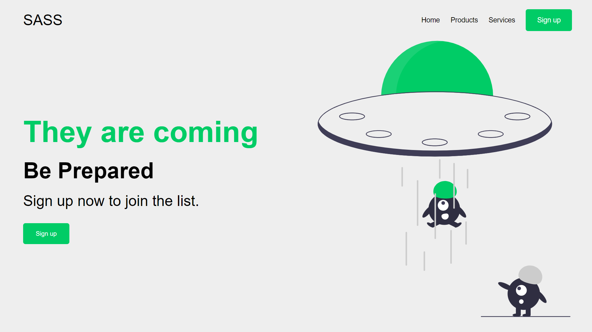

# Responsive Website Homepage

Building a sleek and responsive website homepage. Created a visually appealing website using the power of HTML, CSS, and SASS/SCSS.

## Project Overview

- **What We Are Building**: Gain insight into the final project we'll be creating. 

## Getting Started

- **Creating Project Files**: Set up your project files to get started with the development process.

## Building Blocks

- **Adding Navbar Code**: Implement a navigation bar for seamless user experience.
- **Adding Hero Section Code**: Create an engaging hero section to captivate your audience.

## Styling with SASS/SCSS

- **Adding SASS Styles**: Dive into SASS to enhance your styling with its powerful features.
- **Adding Hero Section Styles**: Fine-tune the hero section styles to achieve a polished look.

## Watch the demo

Feel free to experiment with the code and share your improvements. Let's create something amazing together! Happy coding!

